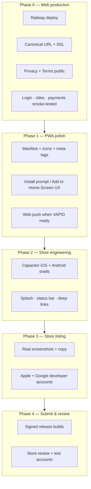

# App Store Launch Plan — PG Ride

**Purpose:** Strategic plan for taking PG Ride from a deployed web app to Apple App Store and Google Play listings.  
**Audience:** Board, product, and engineering — decide *what* and *when* before more implementation.  
**Companion docs:** [APP_STORE_READINESS.md](./APP_STORE_READINESS.md) (build runbook, once Phase 2 starts) · [TRACK_B_CREDENTIALS.md](./TRACK_B_CREDENTIALS.md) (accounts & env vars)

---

## 1. Guiding principle: web first, stores second

PG Ride is already a **mobile-first PWA**. App store listings are a **distribution extension**, not a platform rewrite.

| Layer | Role | User gets |
|-------|------|-----------|
| **Web (primary)** | Full product at a public HTTPS URL | Book rides, pay, chat, SOS — no install required |
| **PWA (web install)** | Add to Home Screen from Safari/Chrome | App icon, standalone window, push (when VAPID is set) |
| **App stores (optional reach)** | Capacitor native shell around the same web app | Discoverability in App Store / Play Store |

**Do not submit to app stores until the web app is production-stable.** Store review will exercise login, booking, payments, and safety flows against the live URL. A broken web deploy blocks both web users and store users.

---

## 2. Architecture decision (locked for v1)

### Chosen approach: Capacitor wrapper loading production URL

| Option | Verdict | Why |
|--------|---------|-----|
| **Capacitor + remote URL** | **Selected** | Reuses 100% of web code; sessions, CSRF, and WebSockets stay same-origin; fastest path to both stores |
| PWA only (no stores) | Valid forever | Zero store fees; works today after Phase 0–1 |
| Google Play TWA (Bubblewrap) | Android-only fallback | Simpler on Android but no iOS; Capacitor covers both |
| React Native / Expo rewrite | Rejected for v1 | Months of rework; duplicates existing PWA |
| Capacitor + bundled assets + remote API | Deferred | Requires cookie/CORS/`SameSite` rework for cross-origin API |

**Native shell loads:** `PUBLIC_APP_URL` (e.g. `https://nbhoodride-production.up.railway.app` today, custom domain when DNS is live).

**Bundle ID:** `com.pgride.app` (iOS + Android).

### What “native” means in v1

Included in scope:

- App icon and splash screen on home screen
- Status bar styling
- Deep link handling (`pgride://` or universal links — Phase 2b)
- Store discoverability and trust signal

Explicitly **out of scope for v1** (follow-up releases):

- Native push (APNs / FCM) — web push works in PWA; native push needs server token registration
- Offline ride booking
- Background location (beyond what the web app already does when active)
- In-app purchases (payments stay Stripe on web)

---

## 3. Phase breakdown

### Phase 0 — Web production ready (blocking)

**Goal:** A stranger can sign up, get approved, book a ride, and pay on the live URL.

| # | Work item | Owner | Done when |
|---|-----------|-------|-----------|
| 0.1 | Railway deploy with `DATABASE_URL`, `SESSION_SECRET` | Track B | `/health` returns OK |
| 0.2 | `PUBLIC_APP_URL` set to canonical HTTPS URL | Track B | Email/SMS/guardian links resolve correctly |
| 0.3 | Super admin bootstrap complete | Track B | Admin can approve users |
| 0.4 | Privacy policy + Terms reachable at `/privacy`, `/terms` | Track A (done) | Public URLs return 200 |
| 0.5 | Stripe keys (if card top-up required at launch) | Track B | Test top-up succeeds |
| 0.6 | Smoke test: rider book → driver accept → complete → receipt | Both | Documented test path green |
| 0.7 | Custom domain (`pgride.com` / `pgride.app`) — recommended before marketing | Track B | DNS → Railway, SSL active |

**Exit criteria:** Production URL is the single source of truth; no critical bugs on core ride loop.

**Runbook:** [PHASE_0_PRODUCTION.md](./PHASE_0_PRODUCTION.md) · `npm run smoke:production` · `GET /health/ready`

---

### Phase 1 — PWA polish (web distribution, no stores yet)

**Goal:** Mobile web users can install PG Ride like an app from the browser.

| # | Work item | Owner | Status |
|---|-----------|-------|--------|
| 1.1 | `manifest.json` with icons, theme, shortcuts | Track A | Done |
| 1.2 | Icon set 72–512 px + apple-touch-icon | Track A | Done (regenerate after final brand) |
| 1.3 | Open Graph / Twitter meta for sharing | Track A | Done |
| 1.4 | Service worker for push + ride widget | Track A | Done |
| 1.5 | “Add to Home Screen” onboarding hint (first visit on mobile) | Track A | **Not started** |
| 1.6 | VAPID keys for web push | Track B | Optional at launch |
| 1.7 | Replace placeholder screenshots with real UI captures | Track B + design | **Not started** |
| 1.8 | `npm run check` includes PWA asset gate | Track A | Done |

**Exit criteria:** Lighthouse PWA checks pass; install flow is obvious on iOS Safari and Android Chrome.

**User-facing message until Phase 4:** *“Visit [URL] on your phone → Share → Add to Home Screen.”*

---

### Phase 2 — Store engineering (Capacitor scaffolding)

**Goal:** Signed native binaries can be built locally; they open the production web app in a native shell.

| # | Work item | Owner | Status |
|---|-----------|-------|--------|
| 2.1 | Capacitor config + `android/` + `ios/` projects | Track A | Done (PR #70) |
| 2.2 | `capacitorBridge.ts` — splash, status bar, deep links | Track A | Done (basic) |
| 2.3 | `npm run build:mobile` script | Track A | Done |
| 2.4 | Android release build (signed AAB) | Track B | Needs Android Studio + keystore |
| 2.5 | iOS release build (Archive) | Track B | Needs macOS + Xcode + Apple team |
| 2.6 | Universal links / App Links for `pgride.com` paths | Track A | **Not started** |
| 2.7 | Replace default Capacitor launcher icons with PG Ride brand | Track A | **Not started** |
| 2.8 | In-app “update available” if web deploy version ≠ shell version | Track A | **Not started** (nice-to-have) |

**Exit criteria:** Internal test build installs on a physical iPhone and Android phone; login and active ride flow work end-to-end.

**Implementation runbook:** [APP_STORE_READINESS.md](./APP_STORE_READINESS.md)

---

### Phase 3 — Store listing preparation

**Goal:** All metadata and assets required by Apple and Google are ready before upload.

| # | Asset / field | Apple | Google | Source |
|---|---------------|-------|--------|--------|
| 3.1 | App name | PG Ride | PG Ride | `store-listing/metadata.json` |
| 3.2 | Subtitle / short description | Subtitle (30 chars) | Short desc (80 chars) | metadata.json |
| 3.3 | Full description | ✓ | ✓ | metadata.json (review copy) |
| 3.4 | Keywords | ✓ | — | metadata.json |
| 3.5 | Category | Travel | Maps & Navigation | metadata.json |
| 3.6 | Privacy policy URL | Required | Required | `/privacy` on production URL |
| 3.7 | Support URL / email | Required | Required | support@pgride.app (verify inbox) |
| 3.8 | App icon 1024×1024 | Required | Required | `store-listing/icon-1024-store.png` |
| 3.9 | Phone screenshots | 6.7" + 6.5" sets | Phone + 7" tablet optional | **Real captures needed** |
| 3.10 | Feature graphic 1024×500 | — | Required | **Not created** |
| 3.11 | Content rating questionnaire | App Privacy + age rating | Play content rating | Track B |
| 3.12 | Data safety / App Privacy labels | Location, contact, payment | Data safety form | Declare what app collects |

**Copy tone:** Community, safety, no surge — aligned with MASTER_PLAN §17 pitches.

**Exit criteria:** App Store Connect and Play Console drafts are 100% filled; only “Submit for review” remains.

---

### Phase 4 — Submit and pass review

**Goal:** PG Ride is searchable in both stores.

| # | Step | Owner | Notes |
|---|------|-------|-------|
| 4.1 | Enroll Apple Developer Program ($99/yr) | Track B | |
| 4.2 | Create Google Play developer account ($25) | Track B | |
| 4.3 | Upload signed AAB to internal testing track | Track B | Test with 5–10 users first |
| 4.4 | Upload iOS build to TestFlight | Track B | Same |
| 4.5 | Provide **demo accounts** in review notes | Track B | Pre-approved rider + driver; explain admin approval flow |
| 4.6 | Respond to review feedback within 24h | Track B | Apple often asks about WebView apps |
| 4.7 | Promote to production | Track B | Coordinate with marketing |

**Review risk — WebView / “minimum functionality”:** Apple may reject thin website wrappers. Mitigations:

- Native splash, status bar, and deep link handling (Phase 2)
- Full account, booking, payment, and safety features (not a marketing site)
- Review notes explaining community approval and Maryland service area
- Test credentials that work without manual admin steps during review window

**Exit criteria:** App live in both stores; store URLs added to website and MASTER_PLAN FAQ.

---

### Phase 5 — Post-launch (not blocking v1)

| Item | Benefit | Effort |
|------|---------|--------|
| Native push (FCM + APNs) | Ride alerts when app backgrounded | Medium — server + Capacitor plugin |
| Universal links | Open `/emergency/:token` from SMS in app | Low |
| `@capacitor/geolocation` bridge | More reliable driver tracking | Low — evaluate vs web geolocation |
| Store analytics (Firebase / App Store Connect) | Download and crash metrics | Low |
| Localized store listings (Spanish) | Match i18n product | Low |

---

## 4. Track A vs Track B

| Track A (engineering / agent) | Track B (you / board) |
|------------------------------|------------------------|
| PWA assets, manifest, meta tags | Apple + Google developer accounts |
| Capacitor scaffolding and scripts | Signing keys (never commit to repo) |
| Deep links, native bridge code | Real device screenshots |
| CI gates (`check-pwa-assets`) | Railway vars, custom domain DNS |
| Store listing copy draft | Final copy approval |
| Review notes template | Test accounts for reviewers |
| | Submit builds and respond to review |
| | Support email inbox live |

---

## 5. Environment variables (store-related)

| Variable | When | Purpose |
|----------|------|---------|
| `PUBLIC_APP_URL` | Phase 0 | Canonical HTTPS URL for links, OG tags, native shell |
| `CAPACITOR_SERVER_URL` | Phase 2 | Override URL baked into native builds (defaults to production Railway) |
| `CAPACITOR_USE_LOCAL=true` | Dev only | Bundle assets instead of remote URL |
| `VITE_VAPID_*` | Phase 1 | Web push in PWA |
| FCM / APNs keys | Phase 5 | Native push (future) |

---

## 6. Success metrics

| Metric | Target (first 90 days post-store) |
|--------|-------------------------------------|
| Web installs (PWA) | Baseline before store launch |
| Store downloads | Track in App Store Connect / Play Console |
| Install → signup conversion | Compare web vs store |
| Store review | Pass on first or second submission |
| Crash-free sessions | > 99% (native shell adds little code) |
| Core ride completion rate | No regression vs web-only |

---

## 7. Open decisions (resolve before Phase 3)

| # | Decision | Options | Recommendation |
|---|----------|---------|----------------|
| D1 | Launch stores before or after custom domain? | Railway URL vs `pgride.com` | **After domain live** — cleaner listing URLs and review credibility |
| D2 | Require Stripe live before store launch? | Yes / cash-only MVP | **Yes** if “payments” is marketed in store copy |
| D3 | Maryland-only vs PG County in store description | Legal/marketing | Align with Terms §2 eligibility |
| D4 | Support email | `support@pgride.app` vs other | Verify deliverability before submit |
| D5 | Android internal test duration | 1 day vs 1 week | **≥ 3 days** with real drivers/riders |
| D6 | Brand icon final | Placeholder vs designed | Replace `generate-app-icons.py` output before Phase 3 |

---

## 8. What not to do

- **Do not** rewrite in React Native for v1 store launch.
- **Do not** submit to stores before Phase 0 smoke tests pass on production.
- **Do not** use placeholder screenshots in final submission.
- **Do not** commit signing keys, keystores, or provisioning profiles to git.
- **Do not** promise native offline rides or App Store IAP in v1 copy.

---

## 9. Recommended execution order

1. **Complete Phase 0** — production deploy, domain, payments if required.  
2. **Ship Phase 1** — PWA install UX + real screenshots on web.  
3. **Board sign-off** on store copy, support email, and demo accounts.  
4. **Phase 2** — internal test builds (PR #70 scaffolding is the starting point).  
5. **Phase 3** — fill store consoles using `store-listing/metadata.json`.  
6. **Phase 4** — submit; iterate on review feedback.  
7. **Phase 5** — native push and deep links as fast follows.

---

## 10. Document map

| Document | Use when |
|----------|----------|
| **This file** | Planning, prioritization, board alignment |
| [APP_STORE_READINESS.md](./APP_STORE_READINESS.md) | Building and uploading native binaries (Phase 2+) |
| [TRACK_B_CREDENTIALS.md](./TRACK_B_CREDENTIALS.md) | Env vars and account setup |
| [MASTER_PLAN.md](./MASTER_PLAN.md) §17 FAQ | User-facing “how do I get the app?” answers |
| `store-listing/metadata.json` | Draft listing fields for Phase 3 |

---

*Last updated: plan created before full store implementation. Phase 2 scaffolding exists on branch `cursor/app-store-readiness-a737` (PR #70) as a head start — merge only after Phase 0–1 sign-off.*
