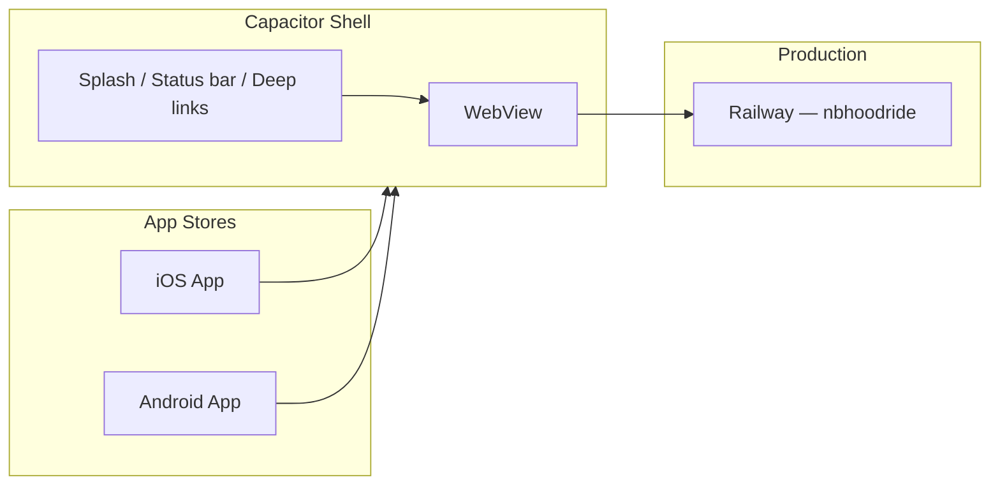

# App Store Readiness — PG Ride

**Status:** Engineering scaffolding complete. Store submission requires Track B accounts (Apple Developer, Google Play) and a signed release build on your machine.

**Live web app:** https://nbhoodride-production.up.railway.app  
**Privacy policy:** `/privacy`  
**Terms:** `/terms`

---

## What’s in the repo

| Asset / config | Purpose |
|----------------|---------|
| `capacitor.config.ts` | Native shell (iOS + Android) loading the production web app |
| `android/`, `ios/` | Capacitor native projects (generated via `npm run build:mobile`) |
| `client/public/icons/` | PWA icons (72–512 px) referenced by `manifest.json` |
| `client/public/screenshots/` | PWA + store listing screenshots |
| `store-listing/icon-1024-store.png` | Apple App Store icon (1024×1024) |
| `store-listing/metadata.json` | Draft listing copy, URLs, categories |
| `scripts/generate-app-icons.py` | Regenerate icons/screenshots after brand updates |
| `scripts/check-pwa-assets.mjs` | CI gate — fails if manifest assets are missing |

---

## Architecture

PG Ride ships as a **Capacitor native wrapper** around the deployed PWA. The WebView loads your Railway URL so login sessions, CSRF, and WebSockets stay same-origin (no cookie/CORS rewrites).



**Alternative (web-only):** Users can still install the PWA from the browser (“Add to Home Screen”) without an app store build.

---

## Prerequisites (Track B — you)

| Item | Apple App Store | Google Play |
|------|-----------------|-------------|
| Developer account | [Apple Developer Program](https://developer.apple.com/programs/) — $99/year | [Google Play Console](https://play.google.com/console) — $25 one-time |
| Build machine | macOS with Xcode 15+ | Any OS; Android Studio |
| Signing | Distribution cert + provisioning profile | Upload key + Play App Signing |
| Privacy policy URL | Required — must be public HTTPS | Required |
| Support contact | Required email/URL | Required email |
| Content rating | App Store questionnaire | Play content rating questionnaire |
| Custom domain (recommended) | Set `PUBLIC_APP_URL` before marketing launch | Same |

Set Railway variable when your canonical domain is live:

```bash
PUBLIC_APP_URL=https://your-domain.com
CAPACITOR_SERVER_URL=https://your-domain.com   # optional override for native builds
```

---

## Build commands

```bash
# 1. Install dependencies
npm ci

# 2. Regenerate icons if needed
npm run icons:generate

# 3. Build web assets + sync into native projects
npm run build:mobile

# 4. Open native IDE
npm run cap:open:android   # Android Studio
npm run cap:open:ios       # Xcode (macOS only)
```

**Local native testing** (bundled assets against local API — advanced):

```bash
CAPACITOR_USE_LOCAL=true npm run build:mobile
# Run API at http://localhost:5000 and configure device to reach it
```

**Production native builds** (default): WebView loads `CAPACITOR_SERVER_URL` or `https://nbhoodride-production.up.railway.app`.

---

## Android release checklist

1. Open `android/` in Android Studio after `npm run build:mobile`
2. Update `android/app/build.gradle` `versionCode` / `versionName` per release
3. **Build → Generate Signed Bundle / APK** (AAB for Play Store)
4. Play Console → Create app → Upload AAB
5. Complete: store listing (use `store-listing/metadata.json`), content rating, target audience, data safety form
6. **Data safety highlights:** location (rides), personal info (account), financial info (payments via Stripe)
7. Add internal testing track first, then production

**Permissions** (auto from Capacitor): Internet, location (when you enable geolocation plugin usage in a future release).

---

## iOS release checklist

1. macOS: `npm run cap:open:ios`
2. In Xcode: set Team, bundle ID `com.pgride.app`, version/build
3. Configure **Sign in with Apple** only if you add Apple login (not required today)
4. **Privacy manifest / App Privacy:** declare location, contact info, financial data as collected for app functionality
5. Archive → Distribute → App Store Connect
6. App Store Connect: listing, screenshots (6.7" + 6.5" iPhone required), 1024 icon from `store-listing/`
7. **Review notes:** Provide test rider + driver accounts; explain community approval flow
8. Apple may scrutinize WebView-heavy apps — native splash, push (future), and deep links are included to demonstrate native integration

---

## Store listing assets

| Asset | Spec | Source in repo |
|-------|------|----------------|
| App icon | 1024×1024 PNG, no alpha (iOS) | `store-listing/icon-1024-store.png` |
| Feature graphic | 1024×500 (Play only) | Generate from brand — not yet committed |
| Phone screenshots | 1080×1920 or device frames | `client/public/screenshots/` (replace with real UI captures before launch) |
| Short description | ≤ 80 chars (Play) | `metadata.json` → `shortDescription` |
| Full description | ≤ 4000 chars | `metadata.json` → `fullDescription` |

Replace placeholder screenshots with real device captures from production before final submission.

---

## Push notifications (native)

Web push (VAPID) works in the PWA. **Native store builds** should use `@capacitor/push-notifications` with FCM (Android) and APNs (iOS) — wiring is scaffolded; full native push requires:

- Firebase project + `google-services.json` (Android)
- APNs key in Apple Developer portal (iOS)
- Server route to register device tokens (future PR)

Until then, in-app WebSocket alerts work; native push can ship in a follow-up release.

---

## Quality gates

```bash
npm run check          # includes PWA asset check
npm test
npm run icons:generate # after brand changes
npm run build:mobile   # before opening Android Studio / Xcode
```

---

## FAQ

**Why not React Native?** The product is already a production PWA. Capacitor reuses 100% of the web codebase and is the fastest path to both stores.

**Will Apple reject a WebView app?** Risk exists if the app is a thin bookmark. PG Ride includes native shell integration (splash, status bar, deep links) and full account functionality. Provide test credentials in review notes.

**When to switch `PUBLIC_APP_URL` to pgride.com?** After DNS points to Railway and SSL is active. Rebuild native apps so `capacitor.config.ts` picks up the new URL.

**Google Play TWA?** Possible Android-only alternative; Capacitor is preferred for one codebase targeting both stores.

---

## Related docs

- [TRACK_B_CREDENTIALS.md](./TRACK_B_CREDENTIALS.md) — env vars and deploy
- [MASTER_PLAN.md](./MASTER_PLAN.md) — product FAQ (app store section updated)
- [Capacitor docs](https://capacitorjs.com/docs)
