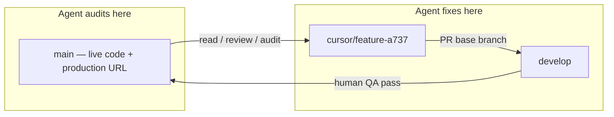

# Git workflow — main (live) vs develop (integration)

**Non-negotiable for all AI agents working on PG Ride.**

---

## Branch roles

| Branch | Role | Deploys to |
|--------|------|------------|
| **`main`** | **Live / production** — what riders and drivers use today | Railway production |
| **`develop`** | **Integration / staging** — test fixes before they go live | Staging (or local QA; promote to `main` when approved) |



---

## Rules for AI agents

### 1. Audit and review → **`main`**

- `git fetch origin main && git checkout main && git pull`
- Read code **as deployed** (production matches `main` after merge)
- Hit live URLs: `https://nbhoodride-production.up.railway.app` (and `peoplegoverned.com` when DNS is wired)
- Run `npm run audit:daily` against production
- Daily playbook: [DAILY_AUDIT_PROMPT.md](./DAILY_AUDIT_PROMPT.md)

**Do not** assume `develop` matches what users see in production.

### 2. Code changes → branch off **`develop`**

```bash
git fetch origin develop main
git checkout develop
git pull origin develop
git checkout -b cursor/your-fix-a737
# implement, test, commit
git push -u origin cursor/your-fix-a737
```

### 3. Pull requests → **base `develop`**, never `main`

| Field | Value |
|-------|--------|
| **Base branch** | `develop` |
| **Compare branch** | `cursor/<descriptive-name>-a737` |

Only a human promotes `develop` → `main` after testing on the integration line.

**Wrong:** PR into `main` from an audit agent.  
**Right:** PR into `develop` → QA on develop → merge to `main` when ready.

### 4. Production changes

Agents **do not** merge to `main` unless explicitly instructed. Track B / owner merges `develop` → `main` for release.

---

## Quick reference

```bash
# Audit (read live)
git checkout main && git pull origin main
npm run audit:daily

# Fix (write code)
git checkout develop && git pull origin develop
git checkout -b cursor/fix-description-a737
# ... work ...
# Open PR: base=develop, head=cursor/fix-description-a737
```

---

## Related docs

- [DAILY_AUDIT_AGENT_INVOKE.md](./DAILY_AUDIT_AGENT_INVOKE.md) — daily agent prompt (includes this workflow)
- [EXECUTION_TRACKS.md](./EXECUTION_TRACKS.md) — Track A vs Track B
- [PHASE_0_PRODUCTION.md](./PHASE_0_PRODUCTION.md) — production checklist
