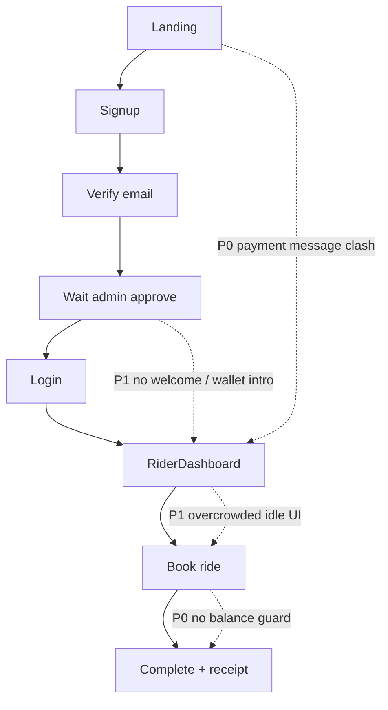

# PG Ride — User-Friendliness Assessment

| Field | Value |
|-------|--------|
| **Document ID** | `USER_FRIENDLINESS_ASSESSMENT` |
| **Product** | PG Ride (People-Governed Mobility) |
| **Repository** | `CNBSSA/nbhoodride` |
| **Assessment date** | 2026-07-17 |
| **Scope** | Rider, driver, and admin **UX only** (copy, flows, navigation, clarity, accessibility signals). **Not** a code or infrastructure review. |
| **Method** | Static review of client UI (`client/src`), shared i18n (`shared/i18n.ts`), and alignment with product promises in `docs/MASTER_PLAN.md`. |
| **Audience** | Product, design, and **downstream agents** — use this file as the canonical user-friendliness baseline before proposing UI/copy changes. |
| **Related docs** | Operational risk: prior agent review (payments/WS/SOS). Daily ops: `DAILY_AUDIT_PROMPT.md`. |

**How to find this document:** search the repo for `USER_FRIENDLINESS` or `USER_FRIENDLINESS_ASSESSMENT`.

---

## Executive summary

PG Ride is **mobile-aware and feature-rich**, with strong building blocks for booking (map, sheets, fare breakdown, active-ride feedback) and driver operations (status, counties, scheduled boards). User-friendliness is held back by **inconsistent payment story**, **unexplained product vocabulary** (PG Card, Circuits, trust degrees), **operator-facing copy shown to riders**, **dashboard cognitive overload**, and **long multi-gate onboarding** (account → email → admin → driver docs → optional background check → go online → counties).

**Overall friendliness (qualitative):**

| Persona | Score (1–5) | One-line verdict |
|---------|-------------|------------------|
| **New rider** | 2.5 | Works if hand-held; easy to misunderstand how to pay and what “PG Card” is. |
| **Returning rider** | 3.5 | Booking and in-ride UX are solid; idle home screen is noisy. |
| **New driver** | 2.0 | Too many gates and jargon; approval status not visible where actions happen. |
| **Returning driver** | 3.5 | Dashboard is capable but dense; go-online flow surprises users. |
| **Admin** | 3.0 | Powerful panels; misleading “Reject” label and 15-tab overload hurt effectiveness. |

**Top five UX priorities (content/design, not implementation detail):**

1. **One payment story** — align Landing, Profile, and booking (“cash” vs Virtual PG Card).
2. **One wallet name + one-sentence explainer** — “PG Card” / “Virtual PG Card” used interchangeably today.
3. **Remove internal/admin language from rider signup success** (e.g. “Users tab”).
4. **First-session rider welcome** — after approval: balance, how to book, how to pay.
5. **Driver path clarity** — approval banner on Driver dashboard; block or explain go-online before approval.

---

## Assessment framework

Each finding uses:

- **Severity:** P0 (blocks or breaks trust) · P1 (major confusion) · P2 (friction) · P3 (polish)
- **Persona:** Rider · Driver · Admin · All
- **Surface:** Screen or component name (for agents to locate in `client/src`)

---

## Part 1 — Rider user-friendliness

### Strengths

- **Signup:** Live password checklist; clear Terms/Privacy gates; pending state explains verify + approval (structure is good even if copy needs cleanup).
- **Login:** Email verification banner with resend; forgot-password visible.
- **Verify email:** Distinct loading/success/error; recovery path to login.
- **Mobile layout:** Narrow column, safe areas, bottom sheets, sticky confirm CTAs (`Home`, `RiderDashboard`).
- **Booking:** Address search empty states; “no drivers nearby”; fare line items and “no surge”; driver cards with match context.
- **Active ride:** Progress stepper, ETA, cancel, chat, quick rating.
- **Top-up:** Preset amounts, limits, success state; wallet balance on Profile.
- **Receipts:** Readable totals and line items; download and report paths.

### Pain points

| Sev | Persona | Surface | Issue |
|-----|---------|---------|-------|
| P0 | Rider | Landing vs Profile vs booking | **Payment contradiction:** marketing “cash-friendly” vs Profile “Cash Only” vs booking “Paid via Virtual PG Card.” |
| P0 | Rider | RiderDashboard confirm | **No pre-book balance warning** when fare exceeds PG Card balance. |
| P0 | Rider | Profile | **Dead controls:** Payment Methods, Help & Support appear tappable but do nothing. |
| P1 | Rider | Signup pending card | **Admin jargon** (“Users tab”, “Drivers tab”) on rider-facing screen. |
| P1 | Rider | Post-approval | **No onboarding moment** — no in-app “you have $20 credit, book here.” |
| P1 | Rider | Global | **PG Card naming** — four variants; “PG” never expanded in UI. |
| P1 | Rider | RiderDashboard idle | **Cognitive overload** — voice intent, transit, community routes, schedule, multi-stop, share/join, circuits compete for attention. |
| P1 | Rider | Share / Join chips | **Ambiguous labels** — difference unclear until opened. |
| P1 | Rider | Circuits | **Jargon** without upfront plain-language subtitle. |
| P2 | Rider | Booking errors | Generic “try again” — no distinction for balance, no drivers, network. |
| P2 | Rider | RideReceiptModal | Raw `paymentStatus` strings shown to users. |
| P2 | Rider | Trust / Autonomy (Profile) | “Degrees”, “Smart match”, “Auto-book” need scenarios, not feature names. |
| P2 | Rider | PWA + Push prompts | Compete for bottom screen space with nav and SOS. |
| P3 | Rider | Receipt download | `.txt` only — many expect PDF or email. |

### Rider journey map (friendliness view)

**Emotional arc:** Hope at signup → confusion at email/admin wait → relief at login → **overload** on home → anxiety at payment wording → satisfaction if ride completes.

---

## Part 2 — Driver user-friendliness

### Strengths

- **Profile:** Status strings for verified, background check, rejected, documents under review.
- **Documents modal:** Photo slot labels; 24h review expectation; replace-existing guidance.
- **Driver dashboard:** Online/offline clarity; scheduled urgency badges; earnings and stats; server errors surfaced on toggle (e.g. still under review).
- **Go-online counties:** Plain question (“which counties today?”); All/None; count on confirm button.
- **Mode selector:** Conversational “I need a ride” / “I’m driving” / “Become a driver.”

### Pain points

| Sev | Persona | Surface | Issue |
|-----|---------|---------|-------|
| P1 | Driver | DocumentUploadModal | Copy says license **front and back**; product stores **one** license image — second file overwrites first. |
| P1 | Driver | DocumentUploadModal | Submit allowed with **partial** docs; no checklist for complete set. |
| P1 | Driver | DriverDashboard | **No approval banner** — user tries go-online, fails late with toast. |
| P1 | Driver | Go-online | Toggle feels one-step; **county sheet is a surprise** second step. |
| P1 | Driver | Geolocation | Errors captured but **not shown** — online without working GPS. |
| P2 | Driver | Profile | Rider wallet + driver onboarding + autonomy + trust in one long scroll. |
| P2 | Driver | Counties | **Permanent** (Profile) vs **today** (go-online) never explained together. |
| P2 | Driver | Dashboard | Dense — circuits, anchors, pro tier, green pool — insider language. |
| P2 | Driver | ModeSelector | “Become a driver” jumps to Profile tab without scroll/highlight to CTA. |
| P3 | Driver | Logout | Icon-only control. |

### Driver onboarding friendliness (conceptual pipeline)

Users must understand **four different “approvals”**:

1. Email verified  
2. **Account** approved (admin Users)  
3. **Driver documents** approved (admin Drivers)  
4. Optional **background check**  
5. **Go online** + pick **today’s counties**

Without a single progress tracker, drivers experience this as “the app doesn’t work” rather than “step 3 of 5.”

---

## Part 3 — Admin user-friendliness

### Strengths

- **Users panel info card** (post product fix): explains Users vs Drivers for signups.
- **Pending sections** at top with color cues; document thumbnails on driver cards; missing-doc warnings.
- **Background-check section** for drivers in Checkr state.
- **Manual email verify** for stuck signups.
- **Two-step confirm** on destructive deletes.
- **Driver approve errors** show server reason (e.g. missing insurance).

### Pain points

| Sev | Persona | Surface | Issue |
|-----|---------|---------|-------|
| P1 | Admin | Users pending **Reject** | Label implies rejection; action is **delete account** — dangerous mislabel. |
| P1 | Admin | Mobile nav | **15 tabs** in horizontal scroll — easy to miss Users/Drivers. |
| P2 | Admin | Navigation | No **pending count badges** on sidebar/tab labels. |
| P2 | Admin | Search | Only Users/Drivers; no ride/dispute/activity search. |
| P2 | Admin | Toasts | Generic “Error” / “User updated” — weak situational awareness. |
| P2 | Admin | Driver approve | No pre-click warning when action sends user to **background check**. |
| P3 | Admin | Driver cards | Raw lat/lng instead of place names. |

---

## Part 4 — Shared components & cross-cutting UX

| Component | Friendly? | Notes |
|-----------|-----------|--------|
| **BottomNavigation** | Good touch targets | Same tabs for rider and driver; Payments page hidden from nav. |
| **PwaInstallPrompt** | Helpful | Can overlap nav; brand strings slightly inconsistent. |
| **PushNotificationPrompt** | Helpful | Duplicates Profile notifications toggle. |
| **AutonomyDial** | Expert-only | Needs plain scenarios; buried in Profile. |
| **CalmRideToggle** | P1 gap | Five modes, **no descriptions** of behavior. |
| **LanguageSelector** | P2 gap | ES/FR raises expectations; **~15 strings** translated in `shared/i18n.ts`, rest English. |
| **ExplainableMatchCard** | Mixed | Match reason helps; “Trust 85” opaque. |

### Terminology glossary (user-facing risk)

| Term | Friendliness issue | Recommended plain-language direction |
|------|-------------------|--------------------------------------|
| Virtual PG Card / PG Card / PG Virtual Card | Same thing, many names | Pick **one** brand term + subtitle “in-app wallet” |
| PG | Unexpanded | Once per session: “PG = People-Governed” |
| Circuits | Opaque | “Community shuttle runs” or similar |
| Share / Join | Collide with “share ride” discount | Rename chips (e.g. “Group schedule” / “Enter group code”) |
| Booking Autonomy | Technical | “How much should we do automatically?” with examples |
| Trust degrees | Graph jargon | “Drivers you know” / “friends of friends” |
| Verified Neighbor | Community-specific | Short trust badge tooltip |
| Green bonus pool | Internal | Hide or “community driver bonus” |

### Accessibility (UX signals from UI patterns)

Not a full WCAG audit; signals for a follow-up a11y agent:

- Many **icon-only** buttons (logout, close modals) without accessible names.
- Custom toggles (calm, language, autonomy) lack **radiogroup / pressed** semantics.
- Admin search fields often **placeholder-only** labels.
- Color + text used well for urgency in places; **10px nav labels** may be small for low vision.

---

## Part 5 — Alignment with product promises

From `MASTER_PLAN.md` founding promises (no surge, explainable matching, calm surface, inclusion):

| Promise | User-friendliness fit |
|---------|------------------------|
| No surge | **Strong** — surfaced in fare UI. |
| Explainable matching | **Partial** — reasons exist; trust score still opaque. |
| Calm / no false urgency | **Weak** — idle dashboard is busy; Calm Ride modes unexplained. |
| Inclusion (voice, SMS, large targets) | **Partial** — mobile targets OK; language setting overpromises; seniors may drown in options. |
| No hidden algorithms | **Partial** — autonomy levels affect behavior without clear consent moment. |

---

## Part 6 — Recommended backlog for a UX-focused agent

Grouped for handoff. **No code in this document** — items are intent for design/copy/IA work.

### Wave A — Trust & clarity (P0–P1)

1. Unified **payment & wallet** messaging across Landing, Profile, booking, receipts.  
2. Rider signup success: **remove admin tab names**; add “check spam”, resend link.  
3. **Pre-book balance** messaging or gate on confirm.  
4. Wire or remove **dead Profile buttons**.  
5. **Post-approval welcome** sheet: balance, first book, notifications optional.  
6. Driver: **status banner** on DriverDashboard; **go-online guard** with human message.  
7. Fix **license front/back** copy or UX to match storage model.  
8. Admin: rename **Reject** → **Delete account** (with confirm copy).

### Wave B — Simplify IA (P1–P2)

9. Rider idle home: **primary** “Where to?”; secondary “More ways to ride” for schedule/circuits/share.  
10. Rename or subtitle **Circuits**, **Share**, **Join**.  
11. Driver onboarding **checklist** component (5 steps).  
12. Admin: **pending badges** on Users/Drivers; mobile tab grouping.  
13. **Calm Ride** mode descriptions (one line each).  
14. Humanize receipt **payment status** and booking **error messages**.

### Wave C — Inclusion & polish (P2–P3)

15. Expand i18n **or** narrow language selector to “beta (calm ride only)”.  
16. Accessible names on icon buttons; radiogroup for autonomy/calm/language.  
17. Receipt PDF or “email me this receipt”.  
18. Consolidate **push notification** entry points.

---

## Part 7 — What not to change without user research

- **Community / trust graph** concepts may resonate in PG County — test before removing.  
- **Circuits** may be strategic — rename/explain rather than delete.  
- **Driver density** on dashboard may suit power users — consider **collapse sections** rather than removing features.

---

## Document maintenance

| When | Action |
|------|--------|
| Major UI release | Re-run rider/driver/admin walkthrough; update scores and tables. |
| Copy-only PR | Note changed surfaces in changelog section below. |
| New persona (e.g. guardian-only) | Add Part 8 appendix. |

### Changelog

| Date | Author | Notes |
|------|--------|-------|
| 2026-07-17 | Cursor agent (UX assessment) | Initial assessment from `client/src` review. |
| 2026-07-17 | Cursor agent (UX implementation) | Waves A–C on `cursor/user-friendliness-implementation-a737` — shared copy, welcome sheet, driver UX, admin badges, calm/language a11y, receipts, SOS Twilio honesty. |

---

*End of `USER_FRIENDLINESS_ASSESSMENT.md`*
